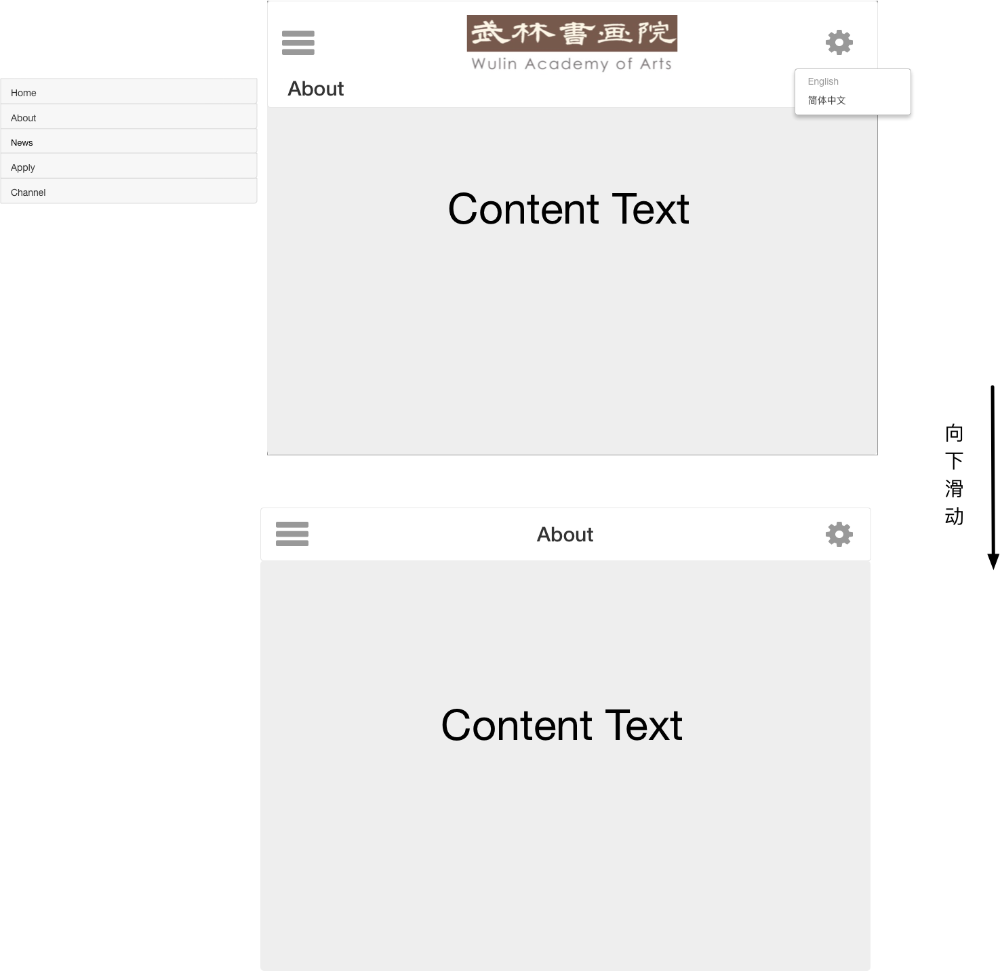
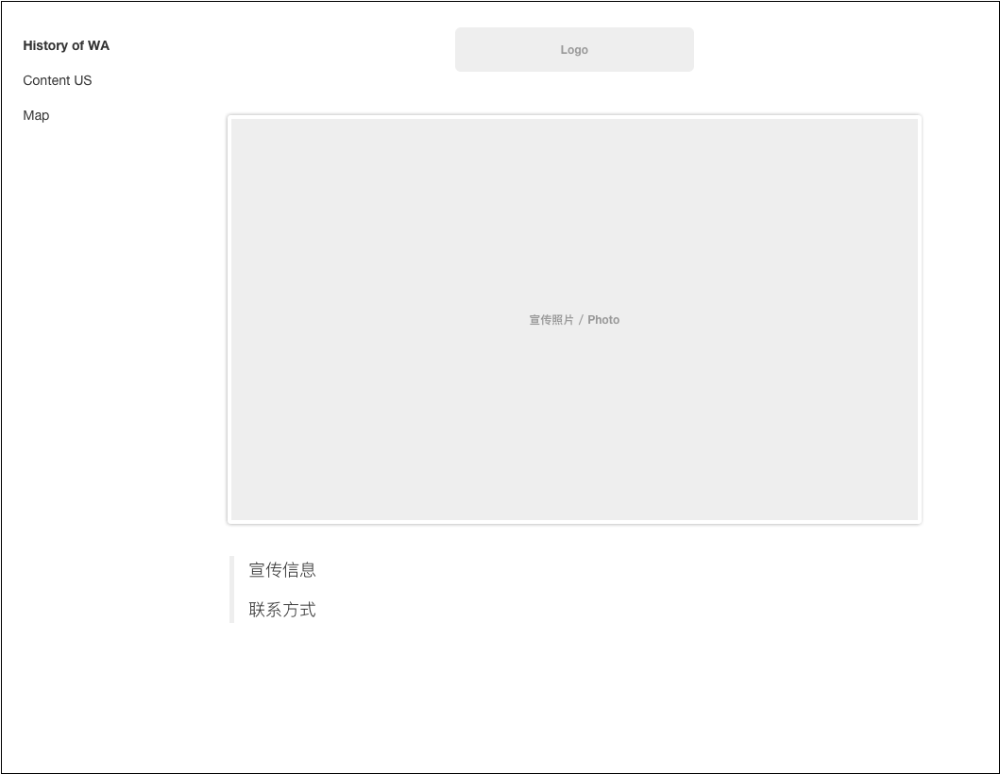
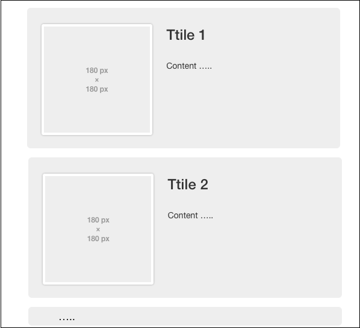
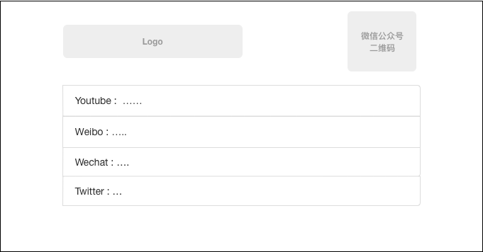

# 需求分析

首先这是一个展示画廊信息和画廊的网站。

总共页面栏目有：

+ About / 关于我们
+ Home / 首页
+ News / 最近信息
+ Apply / 申请
+ Channel / 频道

## 页面结构

以下为我目前个人设计的页面结构

进入主页后，内容

顶部横栏：左侧为[栏目选择]按钮，右侧为[设置]设置按钮，目前包含语言设置选项，中部为Logo

效果：当滚动条向下滑动的时候，将该页的Title 移动到中部，替换原本logo，缩短横栏高度

如图：

### 内容页

内容页，就是关于的5个栏目的信息

#### About

> [页面2](../v0.0.1/website2.pdf)中的**[about]**内容
>
> 根据需求图片设计该页面内容结构
>
> 其子内容为：
>
> + History  of WA
> + Content US
> + Map
>
> 
>
> 

#### News

> 展示展会信息
>
>  从目前内容中只能看出部分结构，因此我设计了以下页面
>
> 
>
> 页面结构：
>
> - 块状新闻
>   - 标题
>   - 配图
>   - 正文

#### Channel

> 列出频道内容即可
>
> 

#### Apply

> 暂无申请页面详细内容以及未知需求无法设计

