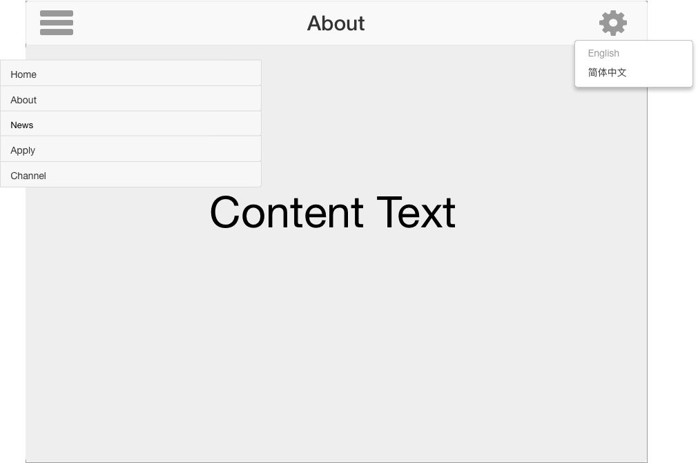
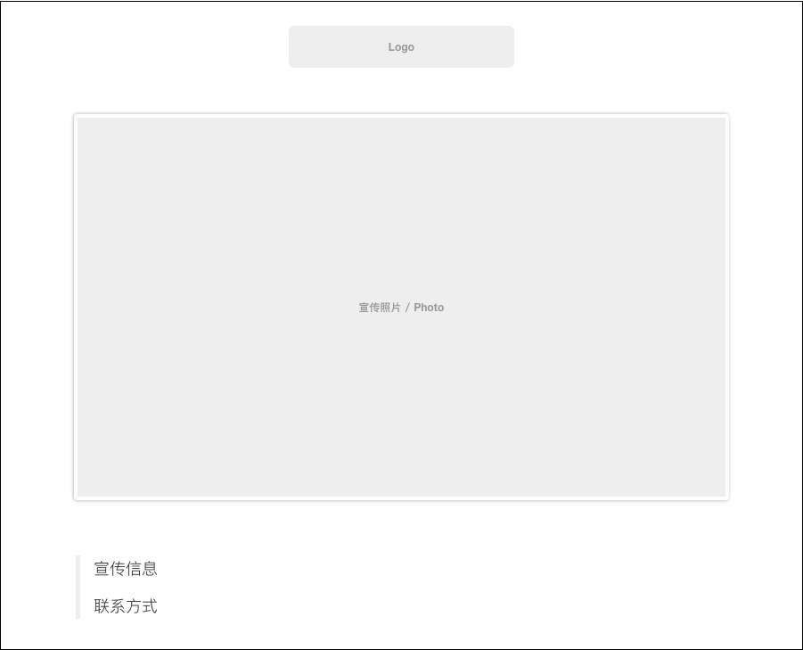
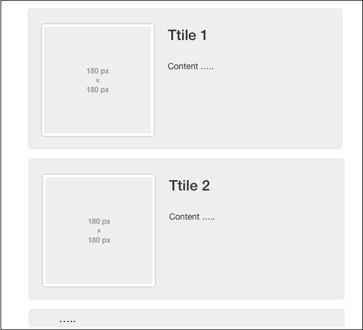

# 需求分析

首先这是一个展示画廊信息和画廊的网站。

根据[v0.0.1](../需求文档/v0.0.1)的素材分析如下：

总共页面栏目有：

+ Home / 主页
+ About / 关于我们
+ News / 最近信息
+ Apply / 申请
+ Channel / 频道

## 页面结构

以下为我目前个人设计的页面结构

进入主页后，内容

顶部横栏：左侧为[栏目选择]按钮，右侧为[设置]设置按钮，目前包含语言设置选项

如图：

### 内容页

内容页，就是关于的5个栏目的信息

#### ~~Home~~

个人分析认为Home主页无需内容

#### About

> [页面2](../v0.0.1/website2.pdf)中的**[about]**内容
>
> 根据需求图片设计该页面内容结构
>
> 
>
> 

#### News

> 展示展会信息
>
>  从目前内容中只能看出部分结构，因此我设计了以下页面
>
> 
>
> 页面结构：
>
> - 块状新闻
>   - 标题
>   - 配图
>   - 正文

#### Channel

> 列出频道内容即可
>
> 

#### Apply

> 暂无申请页面详细内容以及未知需求无法设计

